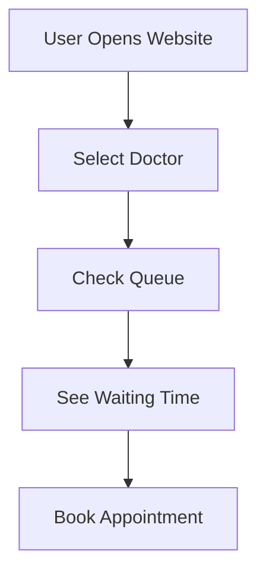

# 🏥 CareFlow

### Real-Time Outpatient Queue System

CareFlow helps patients check doctor queues and estimated waiting time before visiting a clinic.

---

# 🚀 Features

* 👨‍⚕️ Browse doctors by specialization
* ⏳ See estimated waiting time
* 📊 Live patient queue updates
* 📅 Book appointments
* 🩺 Doctor dashboard for updating queue
* 📱 Simple and responsive UI

---

# 💡 Problem

Many patients book appointments online but still wait a long time in clinics because there is:

* No live queue system
* No waiting time visibility
* No idea about clinic workload

This causes:

* Time waste
* Overcrowding
* Poor patient experience

---

# ✅ Solution

CareFlow shows:

* Number of patients waiting
* Estimated waiting time
* Live clinic status

So patients can decide the best time to visit.

---

# 🧠 Waiting Time Formula

\text{Waiting Time} = \text{Patients Waiting} \times \text{Average Consultation Time}

---

# 🛠️ Tech Stack

## Frontend

* React.js
* HTML
* CSS
* JavaScript

## Backend

* Node.js
* Express.js

## Database

* PostgreSQL
* Supabase

---

# ⚙️ How It Works



# ▶️ Run Project

```bash id="jq5zyw"
# Install dependencies
npm install

# Start frontend
npm run dev

# Start backend
npm start
```

---

# 🌟 Future Improvements

* AI waiting time prediction
* Real-time updates using WebSockets
* Mobile app
* Multi-clinic support

---

# 👩‍💻 Team InnovHer

* Ananya Tiwari
* Pratyaksha Sahu
* Rudranshi Malhotra

---

# ❤️ Thank You

Made for Hackathon Project 🚀
